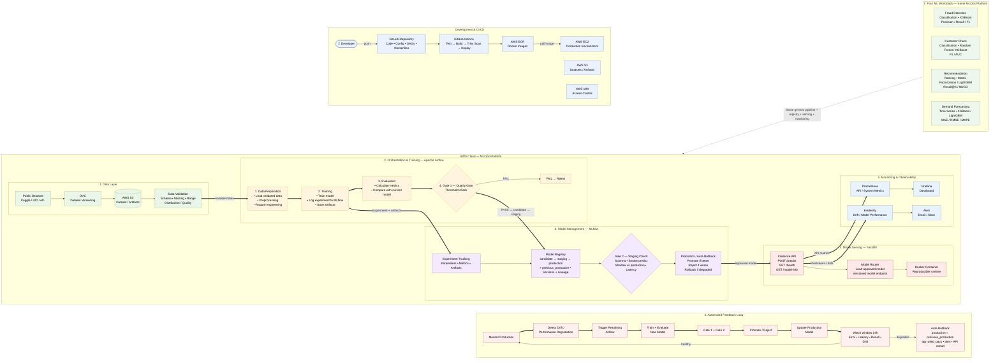

# MLOps Architecture — Clean Flow (AWS)

```mermaid
flowchart TB

  %% ================= DEVELOPMENT / CI-CD =================
  subgraph CICD["Development & CI/CD"]
    direction LR
    DEV(["👤 Developer"])
    GH["GitHub Repository<br/>Code • Config • DAGs • Dockerfiles"]
    GHA["GitHub Actions<br/>Test → Build → Trivy Scan → Deploy"]
    ECR["AWS ECR<br/>Docker Images"]
    EC2["AWS EC2<br/>Production Environment"]
    S3C["AWS S3<br/>Datasets / Artifacts"]
    IAM["AWS IAM<br/>Access Control"]

    DEV -- push --> GH --> GHA --> ECR -- pull image --> EC2
  end

  %% ================= MAIN PLATFORM =================
  subgraph PLATFORM["AWS Cloud — MLOps Platform"]
    direction LR

    subgraph DATA["1. Data Layer"]
      direction TB
      DS["Public Datasets<br/>Kaggle / UCI / etc."]
      DVC["DVC<br/>Dataset Versioning"]
      S3[("AWS S3<br/>Dataset / Artifacts")]
      VAL["Data Validation<br/>Schema • Missing • Range<br/>Distribution / Quality"]
      DS --> DVC --> S3 --> VAL
    end

    subgraph PIPE["2. Orchestration & Training — Apache Airflow"]
      direction TB
      PREP["1. Data Preparation<br/>• Load validated data<br/>• Preprocessing<br/>• Feature engineering"]
      TRAIN["2. Training<br/>• Train model<br/>• Log experiment to MLflow<br/>• Save artifacts"]
      EVAL["3. Evaluation<br/>• Calculate metrics<br/>• Compare with current model"]
      GATE{"4. Gate 1 — Quality Gate<br/>Threshold check"}
      REJECT["FAIL → Reject"]
      PREP ==> TRAIN ==> EVAL ==> GATE
      GATE -- FAIL --> REJECT
    end

    subgraph MLF["3. Model Management — MLflow"]
      direction TB
      TRACK["Experiment Tracking<br/>Parameters • Metrics • Artifacts"]
      REG["Model Registry<br/>candidate → staging → production<br/>+ previous_production • Versions + Lineage"]
      GATE2{"Gate 2 — Staging Check<br/>Schema • Smoke predict<br/>Shadow vs production • Latency"}
      PROMO["Promotion / Auto-Rollback<br/>Promote if better<br/>Reject if worse<br/>Rollback if degraded"]
      TRACK --> REG --> GATE2 --> PROMO
    end

    subgraph SERVE["4. Model Serving — FastAPI"]
      direction TB
      API["Inference API<br/>POST /predict<br/>GET /health<br/>GET /model-info"]
      ROUTER["Model Router<br/>Load approved model<br/>Versioned model endpoint"]
      DOCKER["Docker Container<br/>Reproducible runtime"]
      API --> ROUTER --> DOCKER
    end

    subgraph MON["5. Monitoring & Observability"]
      direction TB
      PROM["Prometheus<br/>API / System Metrics"]
      GRAF["Grafana<br/>Dashboard"]
      EVI["Evidently<br/>Drift / Model Performance"]
      ALERT["Alert<br/>Email / Slack"]
      PROM --> GRAF
      EVI --> ALERT
    end

    %% Cross-module links
    VAL == "Validated data" ==> PREP
    TRAIN == "Experiment + artifacts" ==> TRACK
    GATE == "PASS → candidate → staging" ==> REG
    PROMO == "Approved model" ==> API
    API == "API metrics" ==> PROM
    API == "Predictions / data" ==> EVI
  end

  %% ================= FEEDBACK LOOP =================
  subgraph FB["6. Automated Feedback Loop"]
    direction LR
    FB1["Monitor Production"]
    FB2["Detect Drift /<br/>Performance Degradation"]
    FB3["Trigger Retraining<br/>Airflow"]
    FB4["Train + Evaluate<br/>New Model"]
    FB5["Gate 1 + Gate 2"]
    FB6["Promote / Reject"]
    FB7["Update Production<br/>Model"]
    FB8["Watch window 24h<br/>Error • Latency • Recall • Drift"]
    FB9["Auto-Rollback<br/>production = previous_production<br/>tag rolled_back • alert • API reload"]
    FB1 ==> FB2 ==> FB3 ==> FB4 ==> FB5 ==> FB6 ==> FB7 ==> FB8
    FB8 -- degraded --> FB9
    FB8 -- healthy --> FB1
  end

  %% ================= USE CASES =================
  subgraph UC["7. Four ML Workloads — Same MLOps Platform"]
    direction LR
    UC1["Fraud Detection<br/>Classification • XGBoost<br/>Precision / Recall / F1"]
    UC2["Customer Churn<br/>Classification • Random Forest / XGBoost<br/>F1 / AUC"]
    UC3["Recommendation<br/>Ranking • Matrix Factorization / LightGBM<br/>Recall@K / NDCG"]
    UC4["Demand Forecasting<br/>Time Series • XGBoost / LightGBM<br/>MAE / RMSE / MAPE"]
  end

  %% Section ordering
  CICD ~~~ PLATFORM
  PLATFORM ~~~ FB
  FB ~~~ UC
  UC -. "Same generic pipeline + registry + serving + monitoring" .-> PLATFORM

  %% ================= STYLES =================
  classDef cicd fill:#eaf2ff,stroke:#6c8ebf,color:#000
  classDef data fill:#eaf7e8,stroke:#82b366,color:#000
  classDef pipe fill:#fff5df,stroke:#d6b656,color:#000
  classDef mlf fill:#f3eaff,stroke:#9673a6,color:#000
  classDef serve fill:#ffe9e9,stroke:#b85450,color:#000
  classDef mon fill:#e8f3ff,stroke:#6c8ebf,color:#000
  classDef fb fill:#fff0f0,stroke:#b85450,color:#000
  classDef uc fill:#edf7ed,stroke:#82b366,color:#000

  class DEV,GH,GHA,ECR,EC2,S3C,IAM cicd
  class DS,DVC,S3,VAL data
  class PREP,TRAIN,EVAL,GATE,REJECT pipe
  class TRACK,REG,GATE2,PROMO mlf
  class API,ROUTER,DOCKER serve
  class PROM,GRAF,EVI,ALERT mon
  class FB1,FB2,FB3,FB4,FB5,FB6,FB7,FB8,FB9 fb
  class UC1,UC2,UC3,UC4 uc
```
